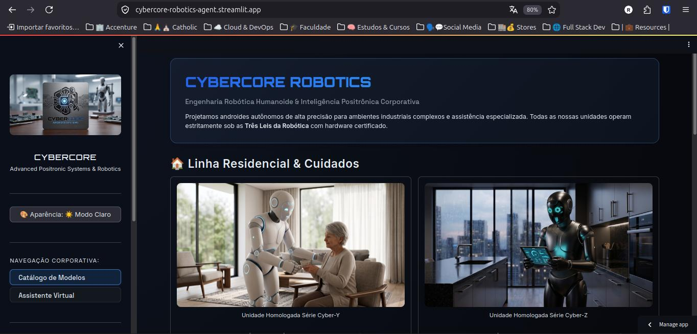
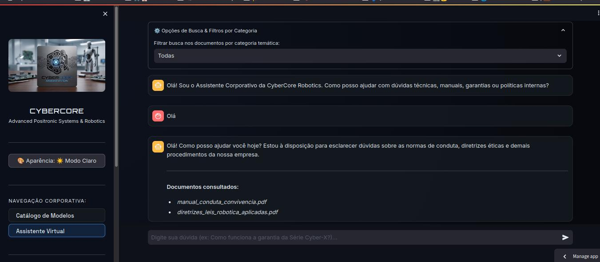
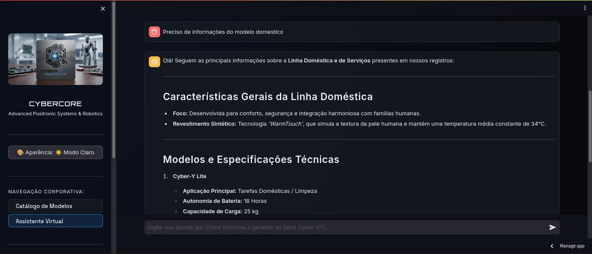

# 🤖 CyberCore Robotics — Agente RAG Corporativo
> **Challenge Alura Agente — Programa ONE (Oracle Next Education)**

Aplicação corporativa com pipeline **RAG (Retrieval-Augmented Generation)** ponta a ponta para consulta e assistência técnica em linguagem natural sobre frotas de androides inteligentes, diretrizes éticas, políticas de RH e manuais operacionais.

---

## 📸 Demonstração e Evidências do Deploy em Nuvem

**🔗 Acesso à Aplicação:** [CyberCore Robotics - Assistente Virtual](https://cybercore-robotics-agent.streamlit.app/)

A aplicação foi implantada e validada em ambiente de nuvem, permitindo auditoria, rastreabilidade e consultas em tempo real da execução.

| Evidência 1: Catálogo de Modelos | Evidência 2: Consulta RAG com Citação de Fontes |
| :---: | :---: |
|  |  |

| Evidência 3: Alternância de Tema e Interação |
| :---: |
|  |

---

## 🛠️ Arquitetura do Pipeline RAG

O sistema foi estruturado de forma modular em Python contemplando as etapas de construção de um agente inteligente:

1. **Ingestão e Processamento (`src/step1_ingestion.py`):** Extração de texto dos documentos e divisão em trechos menores (chunks).
2. **Indexação Vetorial (`src/step2_vectorstore.py`):** Geração de embeddings e organização em um banco de dados vetorial para busca por similaridade semântica.
3. **Recuperação Contextual (`src/step3_retriever.py`):** Busca do vetor numérico da pergunta do colaborador e comparação com os trechos dos documentos indexados.
4. **Agente Conversacional (`src/step4_agent.py`):** Uso do modelo de linguagem (LLM) configurado para validação e controle de alucinação, indicando claramente os metadados de origem de onde cada informação foi extraída.
5. **Frontend Web Interativo (`app.py`):** Interface amigável e acessível construída com **Streamlit**.

---

## 📚 Base de Conhecimento e Metadados

A base foi estruturada com curadoria de qualidade, definindo responsáveis e categorizando os seguintes documentos corporativos gerados para a empresa fictícia:

| Documento | Categoria | Área de Ownership |
| :--- | :--- | :--- |
| `manual_conduta_convivencia.pdf` | RH & Treinamento | Recursos Humanos |
| `politica_recarga_manutencao_baterias.pdf` | RH & Treinamento | Gestão de Infraestrutura |
| `guia_manutencao_preventiva_cyber_x.pdf` | Suporte / Técnico | Engenharia Mecatrônica |
| `manual_atualizacao_firmware_nucleo.pdf` | Suporte / Técnico | Engenharia de Software |
| `catalogo_modelos_domestica_industrial.pdf` | Vendas & Produtos | Área Comercial & Produto |
| `tabela_garantia_cobertura_danos.pdf` | Vendas & Produtos | Suporte & Pós-Venda |
| `diretrizes_leis_robotica_aplicadas.pdf` | Jurídico / Compliance | Comitê de Ética |
| `termos_privacidade_protecao_dados.pdf` | Jurídico / Compliance | Segurança da Informação |

---

## 🚀 Como Executar Localmente

### 1. Clonar o Repositório
```bash
git clone https://github.com/ThiagoRobade/challenge-alura-agent-one-ai-for-tech-g10.git
cd challenge-alura-agent-one-ai-for-tech-g10
```

### 2. Configurar o Ambiente Virtual e Instalar Dependências
```bash
python3 -m venv .venv
source .venv/bin/activate
pip install -r requirements.txt
```

### 3. Configurar as Variáveis de Ambiente
Crie um arquivo `.env` na raiz do projeto e configure a sua chave do Gemini:
```env
GOOGLE_API_KEY="SUA_CHAVE_AQUI"
```

### 4. Executar os Scripts do Pipeline RAG (Opcional se a base já estiver criada)
```bash
# Ingestão de dados
python src/step1_ingestion.py

# Criação do banco vetorial Chroma
python src/step2_vectorstore.py
```

### 5. Iniciar a Interface Streamlit
```bash
streamlit run app.py
```
